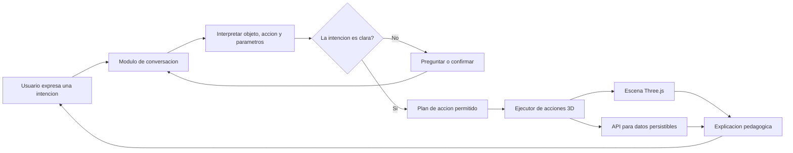
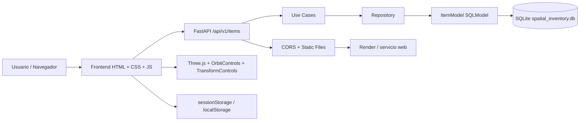
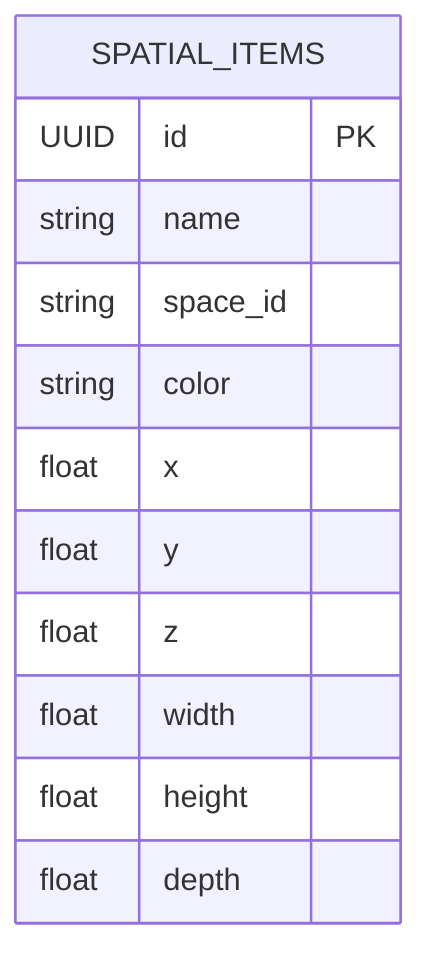

# Arquitectura y organización del proyecto

## 1. Visión general

Este proyecto se compone de cuatro capas principales:

- Frontend: interfaz web con HTML, CSS y JavaScript.
- Backend: API REST desarrollada con FastAPI.
- Base de datos: SQLite gestionado con SQLModel/SQLAlchemy.
- Servidor/deploy: Render para publicar la aplicación web y servir el frontend junto a la API.

La aplicación es un gestor espacial 3D de inventario que permite crear, visualizar, mover, escalar, rotar y eliminar objetos en una escena tridimensional.

## Vision de Mood Module

Mood Module aspira a ser una plataforma educativa 3D, dinamica y modular. El usuario deberia poder describir un objetivo en lenguaje natural; un agente interpretaria la intencion, ejecutaria operaciones permitidas en la escena y explicaria los conceptos y parametros que utilizo. GeoGebra y Blender son referencias de interaccion visual y manipulacion, no una afirmacion de que el sistema ya tenga sus capacidades.

La conversacion con IA y la explicacion pedagogica automatizada aun no estan implementadas. El siguiente flujo es una propuesta de arquitectura futura y no forma parte del diagrama de arquitectura actual ni del codigo ejecutable hoy.



### Principios previstos para el agente

- Resolver la intencion del usuario sin exigir que conozca previamente cada herramienta.
- Desambiguar peticiones que no definan una accion, un objeto o una geometria suficientes; por ejemplo, «triangulo» puede significar una figura plana, un prisma o una piramide.
- Aplicar operaciones mediante acciones controladas del sistema, no modificar la base de datos saltandose la API.
- Explicar los ejes, coordenadas, angulos y decisiones geometricas con un nivel adecuado para el usuario.
- Mantener visible que objeto se modificara y facilitar corregir o deshacer acciones cuando esa capacidad se implemente.

La arquitectura actual continua siendo la que muestran los diagramas PNG: formulario e interfaz Three.js, API FastAPI, casos de uso, repositorio y SQLite. El agente es una direccion de evolucion, no un componente presente.

## Diagramas en PNG

Estos diagramas se generan en la carpeta de imágenes de la arquitectura y están listos para usar en presentaciones, documentacion o entregas:

- [Arquitectura general](imagenes/arquitectura.png)
- [Casos de uso](imagenes/casos_de_uso.png)
- [UML de clases](imagenes/uml_clases.png)
- [Modelo ER / base de datos](imagenes/erd.png)
- [Flujo de funcionamiento](imagenes/flujo_de_trabajo.png)
- [Endpoints](imagenes/endpoints.png)

Los PNG se generan desde `generate_diagrams.py` con Pillow:

```powershell
py -3 docs/arquitectura/generate_diagrams.py
```

---

## 2. Estructura actual del repositorio

```text
Gestor Espacial de Inventario 3D/
├── README.md
├── README_Modulos.md
├── requirements.txt
├── render.yaml
├── backend/
│   ├── main.py
│   ├── spatial_inventory.db
│   └── app/
│       ├── core/
│       │   └── database.py
│       ├── domain/
│       │   └── entities.py
│       ├── infrastructure/
│       │   ├── models.py
│       │   └── repositories.py
│       ├── presentation/
│       │   ├── routes.py
│       │   └── schemas.py
│       └── use_cases/
│           └── item_use_cases.py
├── frontend/
│   ├── index.html
│   ├── css/
│   │   ├── main.css
│   │   ├── base.css
│   │   ├── components.css
│   │   ├── panel.css
│   │   ├── responsive.css
│   │   └── variables.css
│   └── js/
│       ├── api.js
│       ├── main.js
│       ├── scene.js
│       └── components/
│           └── item3d.js
├── database/
│   ├── connection.py
│   └── README_base_datos.md
├── docker/
│   ├── Dockerfile
│   └── docker-compose.yml
├── deploy/
│   └── README_despliegue.md
├── docs/
│   ├── README_documentacion.md
│   └── arquitectura/
│       ├── README_arquitectura.md
│       └── imagenes/
├── tests/
│   └── README_pruebas.md
└── render.yaml
```

### 2.1. Backend

Ubicación: `backend/app`

Responsabilidades:

- `core`: puente de compatibilidad hacia la configuración central de base de datos.
- `domain`: modelos de dominio y reglas del negocio del inventario.
- `infrastructure`: entidades SQLModel y repositorios de persistencia.
- `presentation`: rutas HTTP y validación de entrada/salida.
- `use_cases`: lógica de caso de uso para crear, listar y borrar elementos.

El punto de entrada de la API es `backend/main.py`.

### 2.2. Frontend

Ubicación: `frontend/`

Responsabilidades:

- `index.html`: estructura principal de la interfaz.
- `css/`: estilos globales, paneles, layout responsive y variables de tema.
- `js/api.js`: cliente HTTP para consumir la API.
- `js/main.js`: lógica del editor 3D, formulario, teclado, selección y sincronización con la base de datos.
- `js/scene.js`: escena Three.js, cámara, cuadrícula y transformación.
- `js/components/item3d.js`: creación del cubo 3D que representa cada objeto del inventario.

### 2.3. Carpeta del servidor

En la práctica, el "servidor" es la capa que expone la API y sirve el frontend. En este proyecto está integrado en FastAPI:

- `backend/main.py` monta la carpeta `frontend/` como contenido estático.
- La app sirve la interfaz principal desde la raíz.
- El despliegue se define en `render.yaml` para publicar el servicio en Render.

### 2.4. Carpeta de base de datos

Archivos principales:

- [database/connection.py](../../database/connection.py)
- [backend/spatial_inventory.db](../../backend/spatial_inventory.db)
- `backend/app/core/database.py` reexporta la conexión para el código del backend.

Tecnología:

- SQLite
- SQLModel + SQLAlchemy + aiosqlite

La base de datos se inicializa automáticamente con la función `init_db()` definida en la capa de datos. La URL puede sobrescribirse con la variable de entorno `DATABASE_URL`.

---

## 3. Diagrama de arquitectura



### Explicación

- El usuario interactúa con la escena 3D y el formulario de creación.
- El frontend genera objetos en Three.js y sincroniza con la API.
- El backend valida y persiste los datos en SQLite.
- La interfaz guarda preferencias y sesión localmente para evitar inconsistencias.

---

## 4. Diagrama de caso de uso

```mermaid
flowchart TD
    Usuario[Usuario] --> Crear[Crear objeto 3D]
    Usuario --> Seleccionar[Seleccionar objeto]
    Usuario --> Mover[Mover / rotar / escalar]
    Usuario --> Eliminar[Eliminar objeto]
    Usuario --> Ver[Ver en escena 3D]

    Crear --> API[POST /api/v1/items/]
    Seleccionar --> Gizmo[TransformControls]
    Mover --> PUT[PUT /api/v1/items/{id}]
    Eliminar --> DELETE[DELETE /api/v1/items/{id}]
    Ver --> Scene[Escena Three.js]
```

### Casos principales

1. Crear un nuevo cubo en el espacio con nombre, posición, dimensiones y color.
2. Seleccionar un objeto dentro de la escena.
3. Mover, rotar o escalar el objeto con el gizmo.
4. Eliminar el objeto con teclado o botón de interfaz.
5. Reanudar la sesión con datos locales si la página recarga.

---

## 5. Diagrama ER / base de datos



### Definición funcional

El modelo principal es `ItemModel`, que representa cada elemento del inventario 3D:

- `id`: identificador único.
- `name`: nombre del objeto.
- `space_id`: espacio o almacén al que pertenece.
- `color`: color hexadecimal.
- `x, y, z`: posición en el espacio.
- `width, height, depth`: dimensiones escalares del cubo.

---

## 6. Diagrama de flujo de funcionamiento

```mermaid
flowchart TD
    A[Usuario llena formulario] --> B[Frontend valida campos]
    B --> C[POST /api/v1/items/]
    C --> D[FastAPI recibe payload]
    D --> E[ItemUseCases.create_item]
    E --> F[ItemRepository.create]
    F --> G[SQLModel ItemModel]
    G --> H[SQLite commit]
    H --> I[Respuesta JSON con id]
    I --> J[Three.js crea cubo en escena]
    J --> K[Guardar en sessionStorage]

    L[Usuario selecciona cubo] --> M[TransformControls activo]
    M --> N[PUT /api/v1/items/{id}]
    N --> O[Actualizar nombre, posición, color y space_id]

    P[Usuario pulsa Z / Delete] --> Q[DELETE /api/v1/items/{id}]
    Q --> R[Repositorio elimina fila]
    R --> S[Remover cubo de escena]
    S --> T[Eliminar de sessionStorage]
```

`TransformControls` permite mover, rotar y escalar visualmente. La API actualmente persiste nombre, posición, color y `space_id`; rotación, escala y dimensiones no forman parte de `ItemUpdateSchema` ni se guardan en SQLite.

---

## 7. Endpoints principales

| Método | Ruta                             | Descripción                     |
| ------ | -------------------------------- | ------------------------------- |
| GET    | `/health`                        | Verifica que la API está activa |
| POST   | `/api/v1/items/`                 | Crea un objeto 3D               |
| GET    | `/api/v1/items/space/{space_id}` | Lista los objetos de un espacio |
| PUT    | `/api/v1/items/{item_id}`        | Actualiza datos persistibles    |
| DELETE | `/api/v1/items/{item_id}`        | Elimina un objeto por UUID      |

### Schema de entrada

```json
{
  "name": "Caja de herramientas",
  "position": { "x": 0, "y": 0.5, "z": 0 },
  "dimensions": { "width": 1, "height": 1, "depth": 1 },
  "color": "#00f3ff",
  "space_id": "almacen_principal"
}
```

### Schema de salida

```json
{
  "id": "e4c7b4dd-5a77-4b81-a6d9-10dec9c87564",
  "name": "Caja de herramientas",
  "position": { "x": 0, "y": 0.5, "z": 0 },
  "dimensions": { "width": 1, "height": 1, "depth": 1 },
  "color": "#00f3ff",
  "space_id": "almacen_principal"
}
```

---

## 8. Relación con la capa del servidor y despliegue

El servidor de la aplicación no es un backend separado en una carpeta distinta; está integrado dentro de FastAPI con el mismo repositorio. El servicio se despliega con Render usando `render.yaml`, y el archivo `backend/main.py` actúa como punto de entrada HTTP y de archivos estáticos.

### Diseño actual

```text
Cliente navegador
        ↓
Render (servicio web)
        ↓
FastAPI app
        ├─ frontend static mount
        ├─ /health
        └─ /api/v1/items/*
        ↓
SQLite database
```

---

## 9. Recomendaciones de organización futura

La estructura actual ya separa backend, frontend, base de datos, despliegue, documentación y plan de pruebas. Para ampliar el proyecto sin duplicar esas responsabilidades, se recomienda:

1. Añadir pruebas automatizadas con `pytest` para API, repositorios y casos de uso; `tests/README_pruebas.md` documenta actualmente los escenarios recomendados.
2. Incorporar migraciones de esquema si el modelo SQLite empieza a cambiar con frecuencia.
3. Separar mas responsabilidades del frontend solo cuando el crecimiento de la interfaz lo justifique.
4. Mantener la configuracion por entorno mediante variables de entorno, incluida `DATABASE_URL`.

---

## 10. Conclusión

La estructura actual del proyecto ya está bien organizada para un prototipo funcional: backend con capas limpias, frontend con lógica 3D y UI, y una base de datos ligera con SQLite. Lo más importante es que cada capa tiene una responsabilidad clara y el flujo de datos es consistente entre usuario, API y base de datos.
